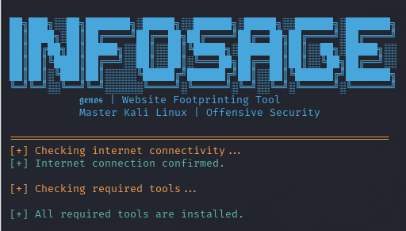
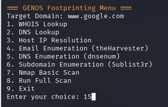
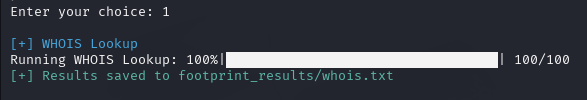
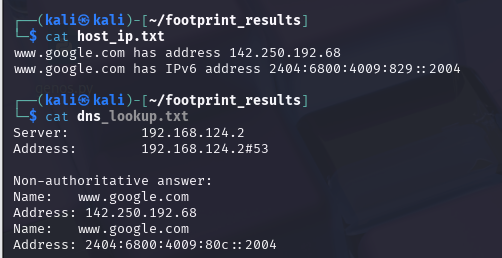

#  INFOSAGE - Website Footprinting Toolkit


---

##  Description
**Infosage** is a fast, modular website footprinting toolkit by **Genos**, built for cybersecurity professionals, ethical hackers, and penetration testers. It automates domain reconnaissance with WHOIS, DNS, email, subdomain, and Nmap scans, featuring progress bars, color-coded outputs, and auto tool installation.

---
## Screenshots

### 🔸 Banner


### 🔸 Tools Menu


### 🔸 Command Executed


### 🔸 Viewing Saved Result


---
## 🛠️ Installation Guide

Follow these steps to install **Infosage** on your system:

### Step 1: Clone the Repository
```bash
git clone https://github.com/GenoS-x15/Infosage.git 
cd infosage
```
### Step 2: Install Python Dependencies
```bash
pip install tqdm colorama
```
---
## Usage Guide
---
```bash
python3 infosage.py <target-domain>
```
  for Example: python3 genos.py microsoft.com

## Features
- WHOIS Lookup
- DNS Lookup
- Host IP Resolution
- Email Enumeration (theHarvester)
- DNS Enumeration (dnsenum)
- Subdomain Enumeration (Sublist3r)
- Nmap Basic Scan
- Full Automated Footprinting
- Real-Time Progress Bars & Colorized Output
- Auto-Installation of Missing Tools
- Internet Connectivity Check
- Organized Result Logging

---

## Requirements
- Python 3.x
- Kali Linux (or compatible Linux)
---
## Author
 **Genos aka (Shubham Singh Rajput)**
- Developer and Creator of Infosage – Website Footprinting Toolkit


---
### Developer's Note

I am a **full-time cybersecurity enthusiast** passionate about building tools for the community. If you are interested in learning, collaborating, or simply want to explore cybersecurity together, please **connect with me on LinkedIn** and follow my work to stay updated with more interesting tools and future releases.

🔗 [Connect on LinkedIn](https://www.linkedin.com/in/r-shubham02/) 

---

###  Pull Requests

Pull requests are generally welcome. However, please keep in mind:
- I am actively working on **new tools** and maintaining several existing ones.
- My response time may vary due to ongoing projects.

If you have an idea for a **significant feature or large code addition**, please contact me first to check if something similar is already in progress. This helps prevent duplicated effort and ensures smooth project alignment.

Thank you for your interest and support! 
